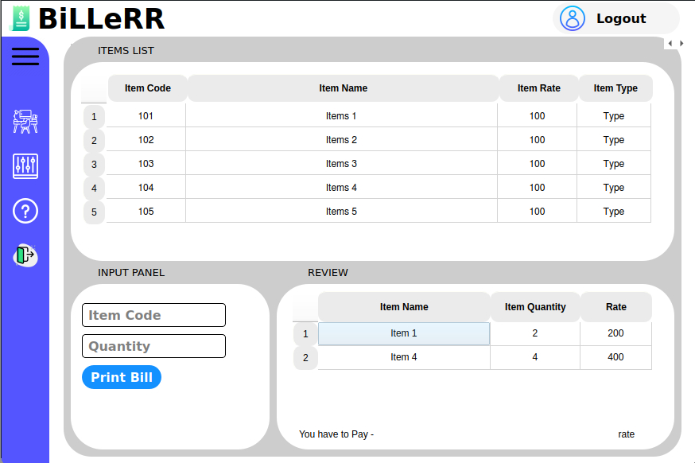

# BiLLeRR App - Bill and Receipt Management System
The BiLLeRR App is a comprehensive bill and receipt management system designed to simplify and enhance the way individuals and businesses organize, track, and manage their financial transactions. By combining intuitive user interfaces with powerful backend features, the app provides a holistic solution for users to effortlessly manage their bills, receipts, and expenses.

# Preview

# Key Features:
- **Real-time Menu Updates:** Pizza shop owners can easily update the menu, prices, and availability in real time, ensuring that customers have access to the latest offerings.

- **Customization Options:** Customers can personalize their pizza orders by selecting crust types, toppings, sauces, and portion sizes. The software dynamically calculates the cost based on the chosen customizations.

- **Secure Online Payments:** The software integrates secure online payment gateways, allowing customers to pay for their orders electronically using credit/debit cards or digital wallets.

- **Inventory Management:** Pizza shop owners can manage their ingredient inventory through the software, receiving alerts when stock levels are low. This helps optimize supply management and prevents order fulfillment issues.

- **Billing and Invoicing:** The software generates accurate bills and invoices for each order, including itemized breakdowns of costs, taxes, and any additional charges.

- **Reporting and Analytics:** Pizza shop owners can access detailed reports and analytics, providing insights into sales trends, customer preferences, and revenue analysis.

- **Customer Feedback:** The software includes a feedback mechanism that allows customers to rate their experience and provide comments, enabling pizza shop owners to continually improve their services.

# Potential Use Cases:
- Independent pizza shops and pizzerias looking to establish an online presence and improve customer engagement.
- Chain restaurants seeking to centralize their online ordering and billing processes.
- Customers who prefer the convenience of ordering pizzas online and customizing their orders.

The BiLLeRR App stands at the crossroads of convenience, organization, and financial empowerment. It addresses the common challenges associated with bill and receipt management, offering an intuitive and versatile platform that empowers users to take control of their financial lives. With its user-friendly interface, advanced features, and emphasis on data security, BiLLeRR revolutionizes the way individuals and businesses manage their financial transactions.
